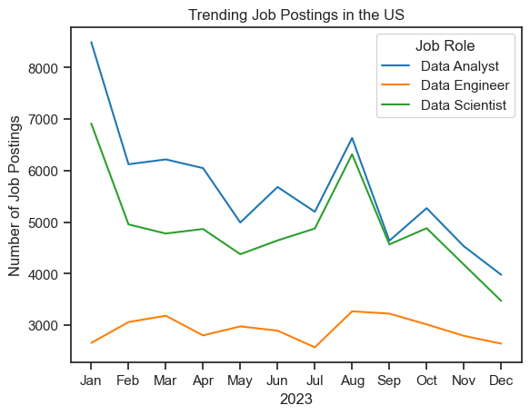
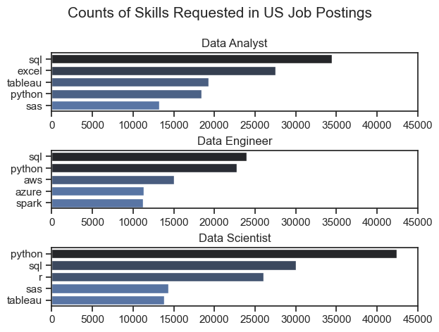
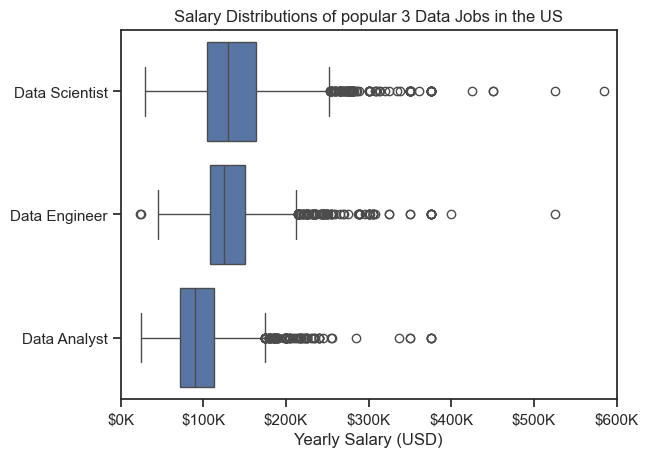
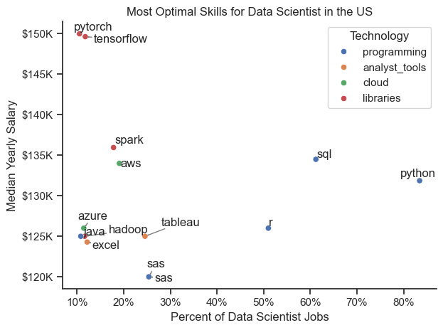

# Overview

Welcome to my analysis of the data job market. This project explores the 2023 data job market to uncover key trends in roles, skills, and salaries. Using a dataset of job postings sourced from [Luke Barousse's Python Course](https://lukebarousse.com/python), the analysis highlights the most in-demand positions, regional demand variations, and essential skills driving the industry.
By applying Python-based analysis, I address questions such as which skills are most sought after, how job demand is distributed geographically, and which skills combine both high demand and competitive salaries — offering insights for aspiring and current data professionals.

# Dataset
- **Source:** The dataset comes from [Luke Barousse's Python Course](https://lukebarousse.com/python).
- **Year:** 2023.
- **Size:** 785741 Row with 17 Columns.
- **Main Columns in my analysis:**
  - `job_title_short`.
  - `job_posted_date`.
  - `job_country`.
  - `salary_year_avg`.
  - `company_name`.
  - `job_skills`.
  - `job_type_skills`.

# The Questions

1. How are job postings for the top three data roles trending over time?
2. What are the skills most in demand for the top 3 most popular data roles?
3. How well do jobs pay for top three Data roles?
4. What are the optimal skills for data scientist to learn? (High Demand AND High Paying)

# Data Cleaning & Preprocessing

The initial dataset was loaded into a pandas DataFrame and inspected for missing values and data types. I then performed the following cleaning and preprocessing steps to prepare the data for analysis:

- Date Conversion: The job_posted_date column was converted from an object to a datetime format to enable time-series analysis.

  ```python
  df['job_posted_date'] = pd.to_datetime(df['job_posted_date'])
  ```

- String-to-List/Dict Conversion: The job_skills and job_type_skills columns, which were stored as strings, were converted into actual lists and dictionaries using the ast.literal_eval function. This was a critical step for being able to "explode" the data and count individual skills later in the analysis.
  ```python
  df['job_skills'] = df['job_skills'].apply(lambda x: ast.literal_eval(x) if pd.notna(x) else x)
  df['job_type_skills'] = df['job_type_skills'].apply(lambda x: ast.literal_eval(x) if pd.notna(x) else x)


- Filtering for US Data: The analysis was focused on the job market in the United States, so the DataFrame was filtered to include only job postings where the job_country was 'United States'.
  ```python
  df_US = df[df['job_country'] == 'United States'].copy()
  ```
These steps were essential to ensure the data was in a usable format for the exploratory data analysis and to get accurate insights into the US data job market.

# Analysis

This section dives into the core of the project, exploring the key questions that define the current landscape of the US data job market in 2023.

## 1. How are job postings for the top three data roles trending over time?

This analysis examines the monthly volume of job postings for the top three data roles: Data Analyst, Data Engineer, and Data Scientist. The goal is to identify trends and patterns in demand for each role over the course of the year.

### Visualize Data
```python
sns.lineplot(data=posting_job_month_pivot,dashes=False, palette='tab10')
plt.show()
```

### Results


### Insights
Based on the trending job postings chart, here are the key insights into the US data job market in 2023:

- **Consistent Demand for Data Analysts:** Data Analyst roles consistently had the highest number of job postings throughout the year, indicating a strong and stable demand for this position.

- **Similar Trends in Demand:** Data Analyst and Data Scientist roles showed a similar trend in demand, with both peaking in January and August.

- **Distinct Peak for Data Engineers:** Data Engineer roles followed a slightly different pattern, with their highest number of postings occurring in March and August.

## 2. What are the skills most in demand for the top 3 most popular data roles?

Here, the focus shifts from job volume to the skills required to get these jobs. This subsection identifies the most in-demand skills for each of the top three data roles. The analysis provides a clear picture of the technical expertise employers are most frequently seeking for Data Analyst, Data Engineer, and Data Scientist positions.

### Visualize Data
```python
fig, ax = plt.subplots(len(top_roles), 1)

sns.set_theme(style='ticks')

for i, job_title in enumerate(top_roles):
    data = df_top_roles[df_top_roles['job_title_short'] == job_title]
    sns.barplot(data=data, x='count', y='job_skills', ax=ax[i], hue='count', palette='dark:b_r')
    
plt.show()
```

### Results


### Insights

- **Python and SQL are the most in-demand skills for all three roles:** Data Analyst, Data Engineer, and Data Scientist. Python is particularly dominant for Data Scientists, while SQL is crucial for Data Analysts.

- **Role-Specific Skills are Highly Valued:** While common skills exist, each role has a unique set of demanded skills.

  - **Data Analysts** require a strong foundation in a business intelligence toolkit, with Excel and Tableau being highly sought-after.

  - **Data Engineers** need skills related to data infrastructure, with AWS, Azure, and Spark being prominent.

  - **Data Scientists** have a high demand for programming languages like R, in addition to Python and SQL, and often require skills in advanced analytics or machine learning.
 
 ## 3. How well do jobs pay for top three Data roles?

This part of the analysis explores how well the data roles are paid. It provides a look at the salary distribution and median salaries for Data Analyst, Data Engineer, and Data Scientist roles in the United States. This helps in understanding the financial compensation landscape and highlights the roles with the highest earning potential.

### Visualize Data
```python
sns.boxplot(data=df_US_top3, y='job_title_short', x='salary_year_avg', order=job_order)

ticks_x = plt.FuncFormatter(lambda y, pos: f'${int(y/1000)}K')
plt.gca().xaxis.set_major_formatter(ticks_x)

plt.show()
```

### Results


### Insights

- **Highest Salary Potential:** Data Scientist roles have the highest median salary and the widest salary spread, which includes some of the highest-paying outliers. This indicates significant earning potential within the field.

- **Data Engineer vs. Data Analyst:** Data Engineer roles have a slightly higher median salary than Data Analyst roles. However, the typical salary range (interquartile range) for both roles is quite similar. This suggests that while Data Engineers generally start at a higher pay grade, their salary growth and variability are comparable to those of Data Analysts.

## 4. What are the optimal skills for data scientist to learn? (High Demand AND High Paying)
Building on the previous two sections, this analysis identifies the "optimal" skills for a Data Scientist to learn. By cross-referencing high-demand skills with high-paying skills, this section provides strategic guidance on which skills offer the best combination of market relevance and financial reward. The scatter plot in this section visually represents this intersection, helping aspiring data scientists prioritize their learning efforts for maximum career benefit.

### Visualize Data
```python
sns.scatterplot(
    data=df_DS_skills_tech_high_demand,
    x='skill_percent',
    y='median_salary',
    hue='technology'
)

sns.despine()
sns.set_theme(style='ticks')

# Prepare texts for adjustText
texts = []
for i, txt in enumerate(df_DS_skills_tech_high_demand['skills']):
    texts.append(plt.text(df_DS_skills_tech_high_demand['skill_percent'].iloc[i], df_DS_skills_tech_high_demand['median_salary'].iloc[i], txt))

# Adjust text to avoid overlap
adjust_text(texts, arrowprops=dict(arrowstyle='->', color='gray'))

ax = plt.gca()
ax.yaxis.set_major_formatter(plt.FuncFormatter(lambda y, pos: f'${int(y/1000)}K'))
ax.xaxis.set_major_formatter(PercentFormatter(decimals=0))

plt.show()
```

### Results



### Insights

- **High-Paying, Lower-Demand Skills:** Libraries like PyTorch and TensorFlow have some of the highest associated median salaries. However, they appear in a smaller percentage of job postings, suggesting they are valuable specialized skills for certain roles.

- **Essential and Well-Compensated Skills:** Python and SQL are the most demanded skills in data science jobs, appearing in a very high percentage of all postings. They also come with a good median salary, making them essential foundational skills for any aspiring data scientist.


