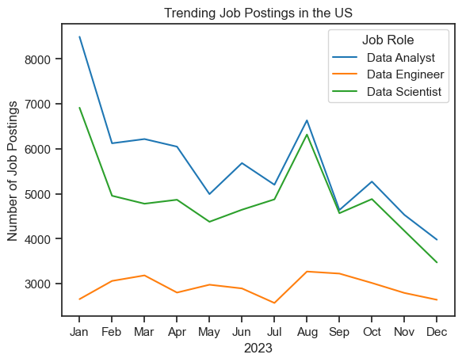
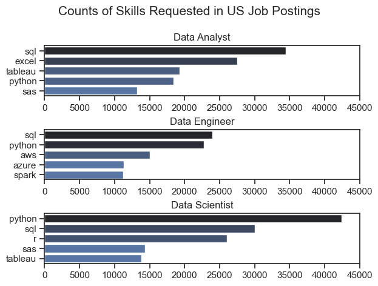
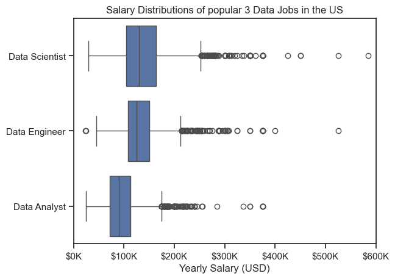
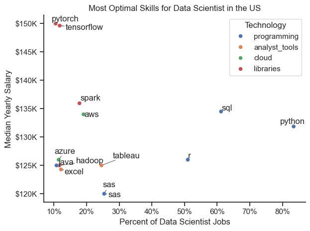

# The US Data Job Market in 2023 📊

An exploratory data analysis of the 2023 US data job market — built to answer a question most students and career-changers actually have: **which data role should I aim for, and which skills are worth learning first?**

## Business Problem

Aspiring data professionals are told to "learn Python" or "learn SQL," but rarely shown *why*. This project uses real job posting data to answer that with evidence: which roles are in demand, what they pay, what skills they require, and which of those skills offer the best return on learning time.

## Dataset

- **Source:** [Luke Barousse's Data Jobs dataset](https://huggingface.co/datasets/lukebarousse/data_jobs)
- **Scope:** ~785K global job postings from 2023, filtered to United States postings for this analysis
- **Key columns used:** `job_title_short`, `job_posted_date`, `job_country`, `salary_year_avg`, `company_name`, `job_skills`, `job_type_skills`

## Objectives

1. How is demand for the top 3 data roles (Data Analyst, Data Engineer, Data Scientist) trending over the year?
2. Which skills are most requested for each of these roles?
3. How well do these roles pay?
4. Which skills give a Data Scientist the best mix of high demand *and* high pay?

## Technologies Used

- **Python** — pandas for data wrangling
- **Matplotlib & Seaborn** — visualization
- **adjustText** — label placement on the scatter plot
- **Jupyter Notebook**

## Project Structure

```
├── Images/              # Charts referenced below
├── data_jobs.ipynb      # Full analysis notebook
└── README.md
```

## Analysis & Insights

### 1. Job Posting Trends


*Monthly posting counts for the three roles throughout 2023.*

Data Analyst is consistently the highest-volume role all year. Data Analyst and Data Scientist demand move together, both peaking in January and August, while Data Engineer postings peak slightly later, in March and August.

### 2. Skills in Demand


*Top 5 skills by posting count for each role.*

Python and SQL show up everywhere, but each role has its own specialty on top of that:

| Role | Core Skills | Specialty |
|---|---|---|
| Data Analyst | SQL, Python | Excel, Tableau (BI tools) |
| Data Engineer | SQL, Python | AWS, Azure, Spark (infrastructure) |
| Data Scientist | Python, SQL | R, ML/analytics tooling |

### 3. Salary Comparison


*Yearly salary distribution by role.*

Data Scientist has the highest median salary and the widest range, including the top outliers. Data Engineer edges out Data Analyst on median pay, though the two roles have a similar typical salary range.

### 4. Optimal Skills to Learn


*Skill demand (% of postings) vs. median salary, Data Scientist role.*

PyTorch and TensorFlow pay the most but appear in a smaller share of postings — specialist skills worth learning once the fundamentals are solid. Python and SQL sit at the sweet spot: extremely high demand *and* strong pay, making them the clear starting point for anyone breaking into data science.

## Key Takeaways

- **Start with Python and SQL** — they're required across every data role and pay well.
- **Data Analyst** is the easiest role to break into by posting volume; **Data Scientist** pays the most.
- Specialized ML libraries (PyTorch, TensorFlow) are worth learning *after* the fundamentals, for a pay premium.

---
*This is a learning/portfolio project built while studying data analysis with Python. All findings are based on the 2023 dataset above and reflect that year's US postings only.*
